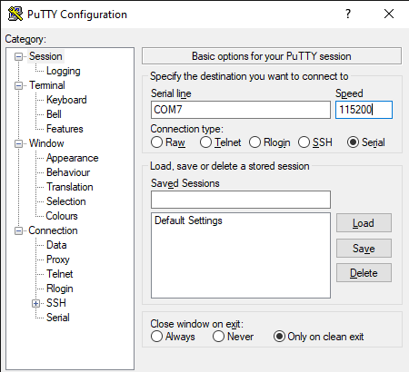

Get-Started
=======================================

Configure device via USB
------------------------
User shall configure the device through USB before use it, user can also skip this step to use default value out of factory.

    Configuration

The device can be powered with the USB, to configure the device, use can simple connect the device with a computer through an USB-C cable. If the computer has driver support, an UART port will be created. User will be able to use console application like putty to access the UART port.

If your windows can not auto recognize the USB device, please download and install here: https://learn.sparkfun.com/tutorials/how-to-install-ch340-drivers/all

After you install the drvier, when the device is connected to your computer, you will be able to find its UART number in device manager

    UART in device manager

Remember the UART number, then use putty to connect the device

    putty

After you successfull connect to the device on console, you will be able interact with the it. You can type info to show the overall info about the device

    Check device info on console

You will be able to see the device information on the console. For detail info on how to configure the device, please refer to "Command Guide".

If you want to connect external DC power or RS485 to the devices other than Jonhson Control's RJ12 interface. Then following info is important. 

Connect wires to RJ-12
----------------------

    RJ-12 pins
