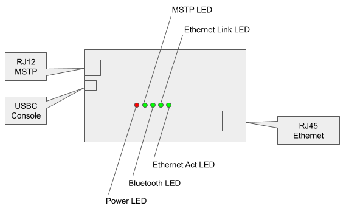

Overview
=======================================

ESP_BacBlue is a handy bacnet tool with Bluetooth support. 

    Overview of the Device

* The device is a bacnet router, it has three network interfaces (RS485 for bacnet MSTP, wifi and ethernet for bacnet IP). End users can use it to access/integrate devices on MSTP trunk from an IP network. User can configure the WiFi interface as a station as well as a hotspot.

* The device supports Bluetooth, it is able to simulate a Johnson Controls’ popular bacnet config tool BTCVT and provide same functionality, if end users want a BTCVT, this is a good candidate.

* The device can be powered though USB-C interface, users can also use the USB console to configure network interfaces and bacnet parameters.

* The device can also be powered by a DC external power supply (range: 12V - 19V).