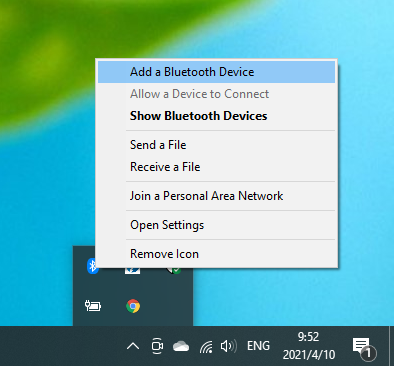

BTCVT
=======================================

BACnet Bluetooth Configuration and Verivication Tool
----------------------------------------------------

Here is the step to use the device as a BTCVT device
1. set device name and bluetooth password
2. Pair with computer
3. Find the rfcomm port

You can use following command on the console to set the bluetooth broadcast name and password
bluetooth  <name> [--pwd=pass]

Factory default value for device name and password are:
   name:    MSTP_WCVT
   pass:    BTCVT

After you know your device name and password, you can start bluetooth pairing. You only need to do this step once on your computer

    bt_pairing_1

    bt_pairing_2

    bt_pairing_3

.. figure:: ../_image/bt_pairing_4.png
    :align: center
    :alt: bt_pairing_4
    :figclass: align-center

    bt_pairing_4

    bt_pairing_5

Now you will be able to find the new add comm port, in device manager. remember the new comm port number
You can identify those rfcomm port by double click them to check detail info
Pairing a bluetooth rfcomm device will add two comm port to your windows, you can try both in johnson control's SW, one of them will work
After you pairing the device, your computer will be able to use it if your device is connected to johnson control's devices

.. figure:: ../_image/bt_pairing_6.png
    :align: center
    :alt: bt_pairing_6
    :figclass: align-center

    bt_pairing_6