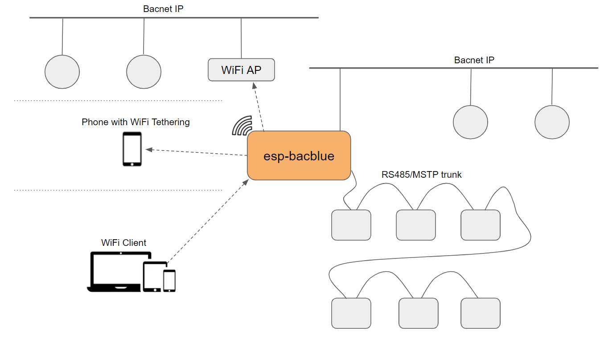

Router
=======================================

Bacnet Router use cases
-----------------------

Bacnet router can connect relatively slower Bacnet MSTP trunk to an IP network, so the server or the client application can use Bacnet IP to access the points of the MSTP devices in the trunk. ESP-bacblue has 3 physical interfaces, it can route Bacnet packet among these 3 interfaces
* RS485 for Bacnet MSTP
* Ethernet for Bacnet IP
* WiFi (STA or AP) for Bacnet IP

    Router Use Cases

Use Case 1: Ethernet + MSTP
Connect the Ethernet to IP network, so any device on the IP network will be able to access MSTP devices connect to router's MSTP

Use Case 2: WiFi connects to Wireless AP + MSTP
This is similar as use case 1, when ethernet cable is not available near MSTP devices

Use Case 3: WiFi connects to a mobile phone with wifi tethering + MSTP
This is often used when user uses mobile phone needs to configure the MSTP devices and access internet at the same time. The esp-bacblue will be a accessary go with the phone so user can plug it into different diagnose RJ12 port and use the mobile phone to do configuration conveniently

Use Case 4:WiFi AP + Ethernet/MSTP
User can attached the esp-bacblue to their bacnet IP/MSTP network and set the esp-bacblue as a wireless access point with credential. This provides an easy and secure way for commission engineer to access the BAS system.

Bacnet Ip Tools
---------------
Yabe is a convenient/powerful bacnet IP tool. https://sourceforge.net/projects/yetanotherbacnetexplorer/

How to get ESP-bacblue's IP address
-----------------------------------
IP address will be shown on the configuration console by command "info", however it's not convenient for end user to use console at any time. And if the esp-bacblue is configured as a DHCP device, it IP address will not be locked down all the time. User will be able to get the ip address through mdns. The mdns name will be device_name.local, device_name is the name user set in the xxxxxx through console.

give example here
